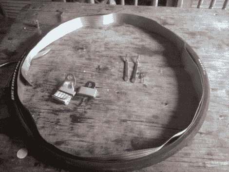

# 旧安全带的防刺穿自行车轮胎

> 原文：<https://hackaday.com/2011/06/22/puncture-resistant-bike-tires-from-old-seatbelts/>

尼古拉斯经常在城市里骑自行车，不止一次他的轮胎瘪了。爆胎听起来没什么大不了的，但是想象一下，如果你离目的地只有几英里远，并且迟到了——现在你的一天变得越来越糟糕。

他正在考虑如何保护他的自行车轮胎不被玻璃和其他碎片刺破，这时他发现了一些旧的汽车安全带，用来作为各种邮差包的带子。他从自行车上卸下轮胎，卸下内胎后，展开了车轮内的安全带。安全带被切割成合适的尺寸，然后将内胎重新插入车轮并正常充气。

他还没有碰到任何玻璃碎片，但尼古拉斯打赌，无论何时，安全带的加强尼龙网都会保证他的管子安全。

[通过[使](http://blog.makezine.com/archive/2011/06/diy-armored-bike-tires.html)