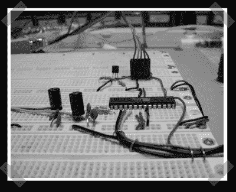

# 利用 AVR 产生 PWM 音频

> 原文：<https://hackaday.com/2008/02/07/pwm-audio-generation-with-an-avr/>

【戴恩】送来了[他的](http://www.rpi.edu/~kouttd/03/Rage_against_the_arduino.html)甜蜜 AVR hack。他使用 PWM 输出来播放预先录制的音频输出。这不是很高的质量，但它可能有助于将低成本音频反馈添加到您的项目中。

*   [永久链接](http://www.rpi.edu/~kouttd/03/Rage_against_the_arduino.html)