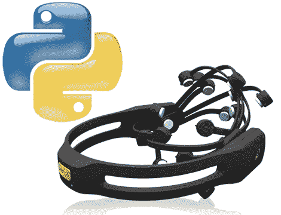

# 用于 Emotiv EEG 的 Python 库

> 原文：<https://hackaday.com/2010/09/13/python-library-for-emotiv-eeg/>

想用意念控制事物？Emotiv EPOCH EEG 是你能得到的最好的硬件之一，随时可以被侵入你的项目。太糟糕了，入门级的 SDK 将花费你 500 美元。或者你可以通过使用[他的 Emotiv Python 库](http://github.com/daeken/Emokit/blob/master/Announcement.md)来利用【Cody Brocious’】的工作。他嗅了嗅通过 USB 接口传入的数据，发现这些数据是加密的。他耍了一点小花招，提取了密钥，并将 128-aes 解密程序嵌入到他的包中。到目前为止，这只是从单元中提取原始数据，因此如何正确过滤信号并区分每个数据流对应的传感器取决于您。但这是一个开始，希望它会导致更多的[精神控制的爸爸](http://hackaday.com/2010/04/28/mind-controlled-rovio/)。