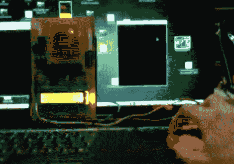

# Python 将鼠标移动映射到 LED 矩阵上

> 原文：<https://hackaday.com/2012/01/13/python-maps-mouse-movements-on-an-led-matrix/>

[Vinod Stanur]正在使用鼠标输入和微控制器驱动的 LED 矩阵。Python 在窗口内跟踪鼠标光标，LED 网格上产生的坐标被照亮。他称之为 LED 矩阵“绘画玩具”,因为他包括的一个功能是让用户像在 MS Paint 中一样创建像素艺术。

10×8 网格的灯由 PIC 16F877A 控制。这种显示方向非常适合 8 位控制器，它使用一个 10 字节的数组来跟踪像素数据。运行他的 Python 应用程序(使用 Pygame 模块跟踪鼠标移动)的计算机通过 RF 连接与显示板通信。五个字节加上一个停止字符组成了通信包。前两个字节包含光标的坐标，另外三个字节包含鼠标按钮的状态。

正如您在休息后的演示中所看到的，系统的响应速度非常快。鼠标可以快速移动，没有延迟问题，如果光标离开跟踪窗口，当它重新进入时会立即被拾取。

[https://www.youtube.com/embed/EMq-896bv9Y?version=3&rel=1&showsearch=0&showinfo=1&iv_load_policy=1&fs=1&hl=en-US&autohide=2&wmode=transparent](https://www.youtube.com/embed/EMq-896bv9Y?version=3&rel=1&showsearch=0&showinfo=1&iv_load_policy=1&fs=1&hl=en-US&autohide=2&wmode=transparent)