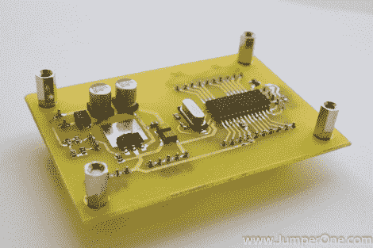

# 快速简单的 DIY PIC 开发板

> 原文：<https://hackaday.com/2011/10/05/quick-and-easy-diy-pic-development-board/>

几个月前，[Phil]希望进入 PIC 开发领域，但是他似乎找不到他想要使用的 PIC16F883 微控制器的简单开发板。由于没有零售产品完全符合他的要求，他决定自己组装一个开发板。

他在 Eagle 呆了几个小时，做了一个简单的电路板布局。[Phil]然后使用可靠的墨粉转移方法，打破了铁和铜包层，使他的开发板成为现实。

他说，电路板本身非常简单，只不过是由 PIC、LM1117 线性稳压器和您可能需要的所有引脚接头组成。虽然非常基本，也不一定是一个黑客，但我们确实喜欢看到人们在市场没有提供他们想要的东西时[制作他们自己的工具](http://hackaday.com/2011/10/02/bread-head-makes-avr-programming-a-snap/)。

如果你一直在寻找一个简单的 PIC 开发解决方案，请务必访问[Phil 的]网站——所有的原理图和布局文件都是免费的。