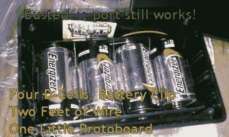

# 快速和肮脏的 USB 手机充电器

> 原文：<https://hackaday.com/2011/04/14/quick-dirty-usb-phone-charger/>

Hackaday 论坛成员[Dan Fruzzetti]写了一篇文章，分享了他前几天创建的一个简单而有用的黑客技术。他和他的妻子都有 Evo 4G 智能手机，他们对缺乏便携式充电解决方案感到非常失望。

[Dan]没有购买一些东西并根据他的需要进行修改，而是决定制造一个快速而肮脏的充电器。他在 Radio Shack 找到了一个廉价的项目箱，里面装有一组四节 D-cell 电池。电池被串联起来，连接到一对安装在一小块原型板上的 USB 端口上。

知道大多数便携式设备已经从充电器获得 5.7v 电压，他并不担心将他的手机直接连接到他制作的 6v 电池组。他说，手机实际上充电非常快，他估计在他需要更换电池之前，他应该可以从盒子里取出大约 50 次充电。

这无论如何都不是一个复杂的攻击。它又快又脏，解决了一个烦人的问题，而且构建起来非常简单。这正是我们喜欢它的原因。