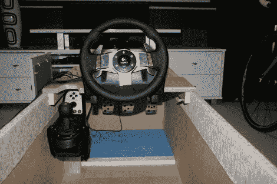

# 搁脚凳内的赛车模拟驾驶舱商店

> 原文：<https://hackaday.com/2010/11/05/racing-sim-cockpit-stores-inside-an-ottoman/>

[Lyscho]基于 PVC 框架建造了一个赛车模拟器驾驶舱，但它在不使用时占用了大量空间。他的第二代产品内置于搁脚凳框架内，这意味着它可以放在你的脚下。

踏板固定在适当的位置，下面有一些衬垫，可以让你的脚后跟休息。驾驶舱座椅和方向盘都可以调节，以适应不同的司机。它们使用一个带翼形螺母和螺栓的槽，便于滑动进行调整。奥斯曼本身就是【Lyscho】自己的创造，使用的时候只需要电源和 USB，不用的时候有一个加垫的顶部。

如果你不能[使用真实的汽车作为模拟器](http://hackaday.com/2010/04/23/driving-the-car-without-going-anywhere/)这是一个很棒的选择。

[通过[使](http://blog.makezine.com/archive/2010/11/game_racing_cockpit_in_an_ottoman.html)