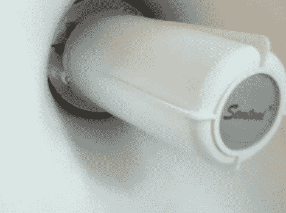

# 收音机-随身听-扩音器混合

> 原文：<https://hackaday.com/2010/06/14/radio-walkman-megaphone-hybrid/>

[Erich]重新考虑了扩音器的使用，并最终使用了这个[巨型磁带电话](http://maomakmaa.blogspot.com/2010/06/mega-tape-o-phone-by-erich-lesovsky.html)。他的第一步是放弃扩音器的放大电路，以便添加自己的基于 LM386 芯片的电路。从那里，一个无线电接收机加入了聚会，后面跟着一个磁带放音机的内脏。他将磁带卡座的头部重新定位到一根柔性电缆的末端，并用磁带包裹扩音器的外部。现在他正在电波中冲浪，快乐地抓挠着。

磁带头的使用以前已经在这里看到过，但它从未出现在像这样的移动包装中。休息之后，请加入我们，观看一些视频。

[https://www.youtube.com/embed/zlaqpdOY4Xc?version=3&rel=1&showsearch=0&showinfo=1&iv_load_policy=1&fs=1&hl=en-US&autohide=2&wmode=transparent](https://www.youtube.com/embed/zlaqpdOY4Xc?version=3&rel=1&showsearch=0&showinfo=1&iv_load_policy=1&fs=1&hl=en-US&autohide=2&wmode=transparent)