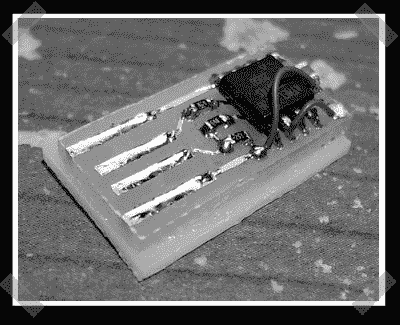

# 随机 USB 瓶盖锁

> 原文：<https://hackaday.com/2008/04/01/random-usb-caps-locker/>

[这个](http://macetech.com/blog/?q=node/46)是我见过的最有创意的愚人节玩笑之一。[加勒特]送来了他的 u 盘。它是由 ATTiny45 制成的，可以发出间歇信号来设置 caps lock 键。考虑到今天是什么日子，它似乎是合法的。在你和你的同事度过了一天之后，你可能会对它所基于的 [easylogger 项目](http://www.obdev.at/products/avrusb/easylogger.html)更感兴趣。

*   [永久链接](http://macetech.com/blog/?q=node/46)