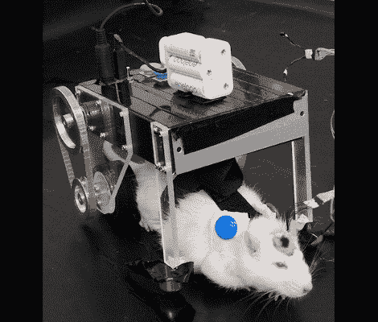

# 大鼠通过脑-机接口推进

> 原文：<https://hackaday.com/2010/10/05/rat-propulsion-via-brain-machine-interface/>

我们的红眼小朋友[可以用意念](http://spectrum.ieee.org/automaton/robotics/medical-robots/researchers-using-rat-robot-hybrid-to-design-better-brain-machine-interfaces)驾驶这辆车到处跑。用他的思想，伙计！

这是适应性技术研究的产物。这个过程非常具有侵入性，在大脑的运动皮层植入神经电极。希望有一天，这将是一个安全可靠的前景，恢复瘫痪患者的行动能力。

我们发现有趣的是，车辆被训练成对老鼠的运动做出反应。当大脑信号被电极监测时，他们被允许在他们自己的动力下在测试空间中移动。视频跟踪被用来将它们的运动与这些信号相关联，这些数据被用来命令日本研究人员称之为 RatCar 的马达。

我们可以看到机械化蟑螂和老鼠大战的可能性。有点像活倾斜的战斗机器人。但是我们孩子，这实际上是相当令人毛骨悚然的。

[通过 [Neatorama](http://www.neatorama.com/2010/10/04/ratcar-is-a-car-operated-by-a-rats-brain/) 和 [PopSci](http://www.popsci.com/technology/article/2010-10/ratcar-tracks-brain-waves-control-movement)