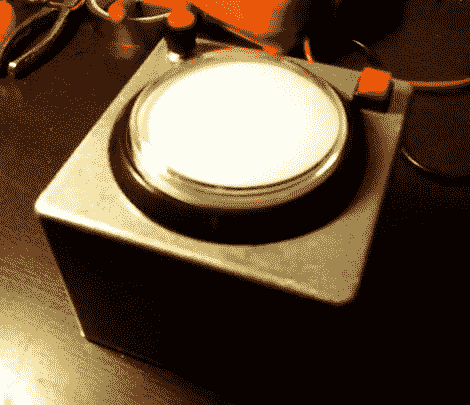

# 用[罗斯]尖叫箱重现 1978 年的辉煌

> 原文：<https://hackaday.com/2012/03/25/re-live-1978-in-all-its-glory-with-the-roth-scream-box/>

我们从未想过[【李尚义·罗斯】会与 Arduino](http://www.flickr.com/photos/tgtsfkncld/6995106433/in/pool-1189547@N20) 配合得很好，直到 Flickr 用户【tgtsfkncld】几天前展示了他的【罗斯】尖叫盒子。

这个不起眼的盒子有点像一个普通的“简易按钮”，但它的有效载荷远比史泰博可能为他们的设备录制的任何东西都有趣。一旦尖叫盒通电，每次按下按钮都会奖励用户一个简短的声音剪辑，内容是[罗斯]演唱[范·海伦]的《与魔鬼共舞》中的歌词。

[tgtsfkncld]从歌曲中截取了一些独立的音轨片段，使用 Arduino 和 Adafruit Wave Shield 一起播放。该设备背后的电路并不太复杂，尽管最终的结果很棒。随着大量的独立人声在网上流传，为你最喜欢的乐队/歌手创作一首也是非常容易的。

继续阅读，看看[罗斯]尖叫箱的行动。

[via [Adafruit 博客](http://www.adafruit.com/blog/2012/03/20/david-lee-roth-scream-box-arduino-adafruit-waveshield-davidleeroth/)