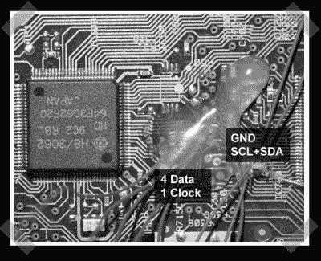

# 阅读 DVD 上的所有内容

> 原文：<https://hackaday.com/2007/09/30/read-every-bit-on-a-dvd/>

如果你对读取 DVD 上的所有位感到好奇，[tmbinc]已经[设计了一个硬件黑客](http://x226.org/?p=17),它使用一个焊接有引线的先锋 DVD 驱动器和一个 Cypress FX2 微控制器板来抓取位流并将其推过 USB2.0。本教程中我最喜欢的部分是当你用手指稍微减慢旋转的 DVD 的速度，并用示波器连接到你认为是来自磁盘的原始数据流。如果在物理上降低磁盘速度时数据速率变慢，则可能是从正确的引脚获取数据。[tmbinc]甚至组装了一个软件工具来处理生成的原始 DVD 数据。

*   [永久链接](http://x226.org/?p=17)