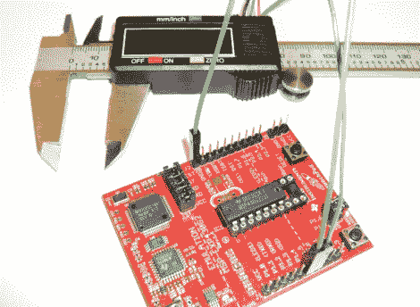

# 用微控制器读取数字卡尺

> 原文：<https://hackaday.com/2010/12/15/reading-a-digital-caliper-with-a-microcontroller/>

[Maris]想要一种从数字卡尺上读取测量值的方法。他最终使用 TI Launchpad 来完成这一任务，但上面并没有列出所有必要的硬件。卡钳在易贝上花了他大约 7 美元，他们有四个接口引脚，这使得这次黑客攻击相当容易。经过一番探索，他确定了他们的目的；电压、接地、时钟和数据。一点点的范围界定证明了数据是以 24 位突发包的形式发送的，这种包非常容易解码。

接下来就是与微控制器接口的问题了。他使用的芯片是 MSP430G2231，运行电压为 3.3V，但卡钳的逻辑高电平仅为 1.5v。通过使用一对晶体管构建适配器，卡钳的数据和时钟能够将 MSP430 上的引脚拉低。这是由[Maris']固件收集和分析的，并且可以使用终端程序在 PC 上读取。

[谢谢克里斯]