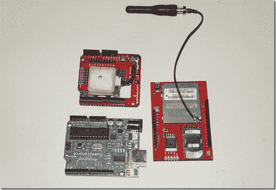

# 带手机上行的实时 GPS 跟踪器

> 原文：<https://hackaday.com/2011/04/14/real-time-gps-tracker/>

当我们建造他的自制 GPS 追踪器时，他并没有试图解决任何聪明的问题。他只是有黑客的心态，想在用电子和软件极客化的同时，做一些有趣和有用的东西。

在硬件方面，他从 Arduino 开始，然后添加了用于位置检测的 GPS 模块和用于通过美国电话电报公司网络将数据上传到服务器的 GMS/GPRS 模块。Arduino 使用了几个库和大量定制代码。在服务器上，他用开源软件包和谷歌地图 API 创造了一些奇迹。所有的源代码和硬件细节都有很好的文档记录。放在一起，这是一个 GPS 追踪器，可以实时更新地图。当然，有商业产品做大致相同的事情，但这有什么意思呢？这里的原理也可以很好地应用于其他基于微控制器的项目。