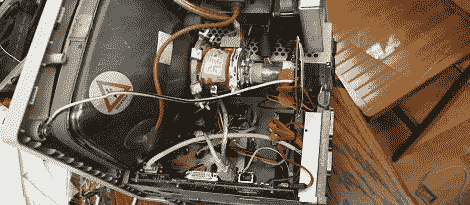

# 再次将 Mac SE 重建为服务器

> 原文：<https://hackaday.com/2011/11/26/rebuilding-a-mac-se-as-a-server-again/>

大约在去年的这个时候，[Sprite_TM]把一台 20 世纪 80 年代的 Macintosh SE 改造成了一台家庭文件服务器。他使用 Seagate Dockstar 作为新的主板，但在过去的一年里，他一直对 Dockstar 没有真正的 SATA 端口感到恼火。在服务器上使用 USB 到 SATA 转换器是一种缓慢的方式，因此[Sprite_TM] [使用惠普瘦客户端重建了他的 SE](http://spritesmods.com/?art=t5325_satapex&amp;f=had) 。为此，他必须拿出板载 SATA 和 PCIE 这不是一件容易的事，但这就是为什么[Sprite_TM]存在的原因。

第一项任务是安装一对 SATA 端口。普通瘦客户机有两个 NAND 闪存芯片作为驱动器，都连接到 SATA 控制器。[Sprite_tm]所要做的就是将闪存芯片拆焊，并连接新的 SATA 连接。很简单。

因为惠普瘦客户端只有 100Mbps 的以太网，所以[Sprite_tm]并不期待他预期的 rsync 速度与他通过 1Gbps 连接获得的速度之间的数量级差异。唯一的问题是瘦客户机没有以太网卡的备用 PCIE 连接。不过，对于[Sprite_tm]来说，这真的不成问题:只需解除 GPU 的休眠并运行几条线路。

就像[去年在他的 SE 上的作品](http://hackaday.com/2010/11/04/mac-se-reborn-as-a-server-and-mac-emulator/)，【Sprite_tm】最终得到了一个功能强大且非常酷的家庭服务器。老派系统 7 还在，当然他还能玩[超越黑暗城堡](http://www.youtube.com/watch?&v=nvWY7wD8XEg&t=2m55s)。在我们看来，这是一项了不起的工作。