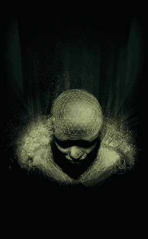

# 侦察 2008 摘要

> 原文：<https://hackaday.com/2008/07/03/recon-2008-recap/>

[Tiller Beauchamp]在[今年的 REcon](http://blogs.zdnet.com/security/?p=1406) 上，在 OS X 做了一个关于[应用逆向工程](http://blog.poppopret.org/?p=9)的演讲，但他也参加了许多其他的演讲，并在 ZDNet 博客 Zero Day 上发表了他对 REcon 2008 亮点的看法。

对他来说，其中一个亮点是 Neohapsis 的[克里斯·史密斯]讨论实现代码混淆的[虚拟机](http://labs.neohapsis.com/2008/06/14/minivm-recon-release/)。该方法使用自定义指令和运行时解释器，如果实施得当，这有助于使逆向工程任务变得更加困难。

另一方面，[Beauchamp]提到了[Gerardo Richarte]的软件逆向工程工具，它以迭代的方式反编译和重新编译软件。这允许重新编译的软件被一部分一部分地测试。一定要看他的帖子，看看你错过了什么。

*   [永久链接](http://blogs.zdnet.com/security/?p=1406)