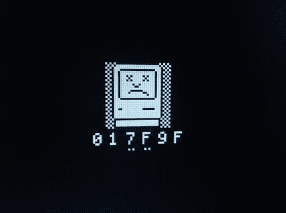

# 用 FPGA 再造 Mac Plus

> 原文：<https://hackaday.com/2011/09/16/recreating-the-mac-plus-with-an-fpga/>

大混乱电线公司的史蒂夫从未如此高兴地看到“悲伤的苹果”图标。

一个多月前，他决定接受任务，利用现代技术打造自己的 Mac 克隆产品。不要与现代硬件上的 Mac 仿真混淆，他正试图使用功能与原始产品相同的 FPGA 构建一个真正的 Mac 克隆。

他把他的发明称为“PlusToo”，目标是生产一个现代版的 Macintosh Plus。Plus 与它的其他原始 Mac 兄弟共享大量硬件，允许他复制任何其他机器，如 Mac 128K，只需进行一些简单的配置更改。

建造这个克隆体是一项不可思议的事业，看着一点一滴的建造进度是一件非常有趣的事情。[Steve]已经努力工作了一个多月了，最近让克隆体运行了 Mac ROM 中的 68000 个代码，产生了你在上面看到的悲伤的 Mac 图像。虽然这个标志多年来一直让 Mac 用户感到恐惧，但它向(史蒂夫)发出了事情进展顺利的信号。