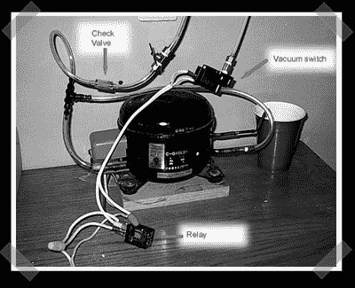

# 冰箱压缩机真空装袋

> 原文：<https://hackaday.com/2006/09/10/refrigerator-compressor-vacuum-bagging/>

我在查一些建筑窍门，偶然发现了这个[小宝石](http://www.badger.rchomepage.com/vacbag.html)。真空袋用于压缩/去除树脂/玻璃纤维/碳叠层中的空气。这种设置使用一个普通的冰箱泵和一些管道来产生所需的恒定真空。

*   [永久链接](http://www.badger.rchomepage.com/vacbag.html)