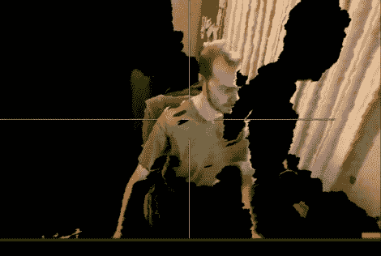

# 从 Kinect 视频渲染 3D 环境

> 原文：<https://hackaday.com/2010/11/15/rendering-a-3d-environment-from-kinect-video/>

[Oliver Kreylos]正在使用一台 [Xbox Kinect 从实时视频](http://idav.ucdavis.edu/~okreylos/ResDev/Kinect/index.html)中渲染 3D 环境。换句话说，他从 Kinect 获取视频，并通过他编写的一些 C++软件运行它，以索引 3D 空间中的像素，可以在播放时对其进行操作。上图是 Kinect 从[Oliver]右侧观看录制视频的结果。他将观众的回放视角移到了他的上方和前方。他身体的一部分不见了，有一个黑色的影子，因为摄像机不能从它的角度看到这些区域。这与我们过去见过的[实时 3D 扫描](http://hackaday.com/2009/12/30/update-realtime-3d-for-you-too/)非常相似，但硬件和软件的结合使其易于重现。从顶部链接的他的页面获取源代码，休息后不要错过他的演示视频。

[https://www.youtube.com/embed/7QrnwoO1-8A?version=3&rel=1&showsearch=0&showinfo=1&iv_load_policy=1&fs=1&hl=en-US&autohide=2&wmode=transparent](https://www.youtube.com/embed/7QrnwoO1-8A?version=3&rel=1&showsearch=0&showinfo=1&iv_load_policy=1&fs=1&hl=en-US&autohide=2&wmode=transparent)

[谢谢彼得]