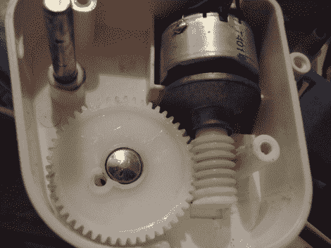

# 从不太可能的来源维修零件

> 原文：<https://hackaday.com/2011/02/27/repair-parts-from-unlikely-sources/>

[Jay]给我们发来了他拥有的一个婴儿秋千的一些细节，以及他找到替换零件的不太可能的地方。[本周早些时候，我们向你展示了他的一对作品](http://hackaday.com/2011/02/24/555-two-fer-baby-swing-upgrade-and-a-headphone-tube-amp/)，你可能还记得。幸运的是，他改装的婴儿秋千上的马达在我们报道他的黑客后不久就烧坏了。别担心——他砍秋千时没有弄坏它，也没有一天砍一架的诅咒。纯属巧合，我们发誓！

秋千已经有 7 年的历史了，所以烧毁的马达并不令人惊讶。在做了一些研究后，看起来他可能需要支付 70-100 美元来更换电机。他幸运地发现了一个论坛帖子，说廉价空气清新剂的马达是完美的匹配，所以他试了一下。果然，这是同样的电机，但扭矩更大。只花了 5 美元就能让秋千像新的一样运转起来。

这只是表明，你永远不知道有用的普通物品可以，直到你把它们拆开，看看里面是什么。