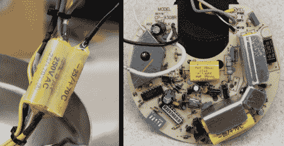

# 修理损坏的钢筋混凝土吊扇

> 原文：<https://hackaday.com/2010/12/23/repairing-a-broken-rc-ceiling-fan/>

史蒂夫·维格诺卧室的吊扇开始给他带来麻烦。它通常使用遥控器操作，但功能已经变得相当参差不齐。他清洁了遥控器上的触点，但仍有问题，只能通过重启风扇本身来解决。当它最终熄火时，他开始自己修理这台机器。上面你可以看到风扇的控制板。对[史蒂夫]来说，排除故障有点太复杂了，所以他想为什么不停止使用遥控器，让它和几个开关一起工作呢？经过一番研究，他找到了一些基本的风扇原理图，并以此作为参考。他需要拆下几个电容器，用一个开关连接风扇，另一个开关连接电灯。当然，没有速度或方向的设置，但[史蒂夫]认为他不需要改变它们，并且总是可以选择在未来添加它们。