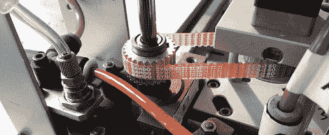

# 修理商业级取放机器

> 原文：<https://hackaday.com/2011/12/28/repairing-a-commercial-grade-pick-and-place-machine/>

看起来零空间实验室有了新的[拾取和放置机器](http://charliex2.wordpress.com/2011/12/13/null-space-labs-juki-360-rebuild-part-iv-yes-were-in-la/)。当[Charliex]和[Gleep]发现一台 JukiPlacemat 360 抓放机时,[开始了这项艰巨的维修工作。拥有自己的取放机的想法被证明是令人陶醉的，可能太多了，因为当他们发现机器不工作时，他们没有归还机器。](http://hackaday.com/2011/09/06/salvaging-a-commercial-grade-pick-and-place-machine/)

经过大量的工作，包括添加摄像头，零空间实验室的 Charliex 和其他建造者终于有了他们自己的取放机器。这是一次彻底的重建。这么多东西在这台机器上不工作，他们可能会更好地从零开始建立一个。除了把一台机器的外壳变成一个工作单元所付出的巨大努力之外，我们真的要表扬每一个为它工作的人。

团队增加了一个漂亮的 GUI 来控制机器。这些家伙已经运行了一个成功的测试和烤箱几板，所以一切工作，因为它应该在购买。这对制作明年的 [LayerOne 会议徽章](http://hackaday.com/2011/04/23/the-layerone-hacking-conference-is-around-the-corner/)很有帮助。