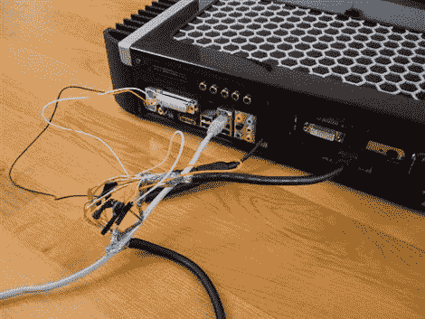

# 修理你的电视 EDID

> 原文：<https://hackaday.com/2010/02/17/repairing-your-tv-edid/>

[Andreas]发现他的[家庭影院电脑有一天](http://www.lonelycoder.com/blog/?p=14)无法启动。奇怪的是，如果他把 HDMI 线从电视上拔下来，电视会正常启动。虽然我们中的大多数人会深入研究 PC，但他意识到这是来自电视的不正确信号。幸运的是，LG 在电视中包含了完整的原理图。使用自制的监听器，他能够弄清楚的是[EDID](http://en.wikipedia.org/wiki/Extended_display_identification_data)EEPROM 不知何故损坏了。不要担心，[安德里亚斯]拼凑了一个成熟的 I2C 接口，并准备用正确的数据重新编程。然而，他注意到 eeproms 是写保护的。他突发奇想，决定用任何方式给他们写信，发现都是成功的。他有一些关于为什么它们是可写的理论，但他说他不想把电视拆开来确认。

[谢谢 evlapix]