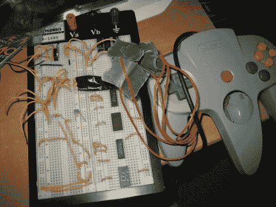

# 更换 N64 的磨损操纵杆

> 原文：<https://hackaday.com/2011/02/08/replace-an-n64s-worn-out-joystick/>

随着游戏控制台的老化，控制器将不可避免地出现一些磨损，并且可悲的是，可能会一起用完。[凯尔]不忍心看着他的任天堂 64 控制器被打得落花流水，所以[他用一个 PlayStation](http://nfggames.com/forum2/index.php?topic=3574.0)的拇指棒代替了拇指棒。这是一项比你想象的更大的工作，因为这两个部分是根本不同的。最初的 N64 stick 使用旋转编码器向控制芯片输出数据，而 PlayStation stick 是一种模拟设备。[Kyle]的解决方案是使用 PIC 读取模拟值，但是在线程的下方，您可以看到另一个用户使用 AVR 完成了类似的攻击。两者都将信号转换成 N64 芯片监听的旋转编码器格式。从休息后嵌入的剪辑看，这不能再好了！

[https://www.youtube.com/embed/QFbFlmr-h2Q?version=3&rel=1&showsearch=0&showinfo=1&iv_load_policy=1&fs=1&hl=en-US&autohide=2&wmode=transparent](https://www.youtube.com/embed/QFbFlmr-h2Q?version=3&rel=1&showsearch=0&showinfo=1&iv_load_policy=1&fs=1&hl=en-US&autohide=2&wmode=transparent)

[谢谢爷爷]