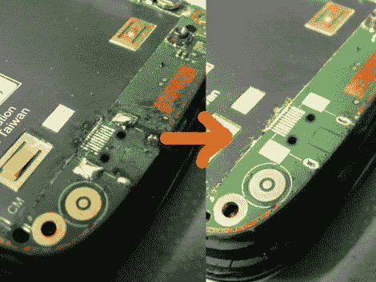

# 更换非标准 USB 充电端口

> 原文：<https://hackaday.com/2011/07/13/replacing-non-standard-usb-charging-ports/>

虽然许多手机制造商正在将 micro-USB 接口作为标准，但苹果和 HTC 等其他公司仍在逆潮流而动。arto 的部分工作包括修理手机，上个月他发现自己面对着一对坏了的 HTC 手机[，需要更换充电端口](http://amazingdiy.wordpress.com/2011/07/13/htc-connector-repairs/)。

HTC 专有连接器的替代品显然很难找到，[arto]说他不得不从 HTC 维修中心购买。有了合适的零件，他终于可以开始工作了。

他修理的 HTC Hermes 手机轻而易举，因为它在充电口周围有足够的空间。他说这让他可以很容易地更换插孔，但相比之下，HTC Touch Dual 简直是一团糟。他从移除旧适配器开始，这是通过一点一点地切割它来完成的。他说，他这样做，而不是拆焊，因为它接近其他热敏元件。在显微镜下仔细焊接后，一切都恢复了正常。

虽然他的修复并不一定是黑客做的东西，但这些信息仍然很有帮助。损坏的充电端口在智能手机中非常常见，而且由于大量这些旧型号仍在使用，他的建议可能会帮助一些人在更换手机时节省一些钱。