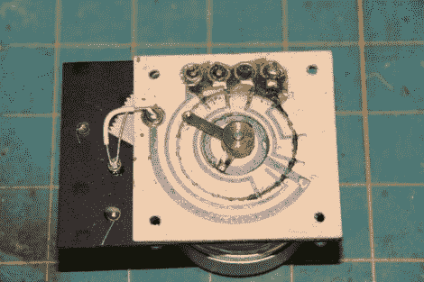
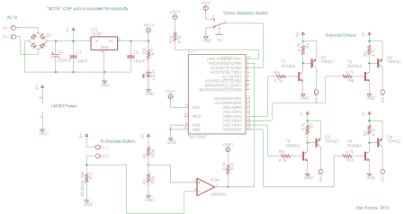
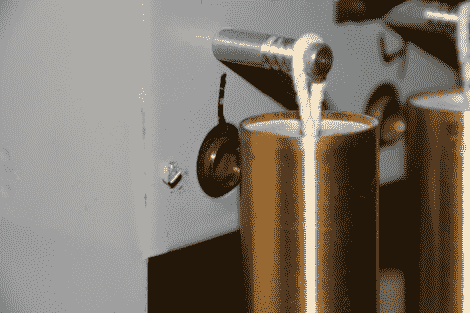

# 更换老式门铃中的驱动板

> 原文：<https://hackaday.com/2010/09/01/replacing-the-driver-board-in-an-old-school-door-chime/>

[丹·考巴的]父母把他们的门铃按钮换成了一个会发光的按钮，发现按下按钮后蜂鸣器不会停止鸣响。这些发光的按钮使用一个与按钮平行的白炽灯泡(我们过去已经黑过的一个硬件)。它消耗少量的电流，不足以触发钟声，但足以使钟声装置作出反应，就好像按钮按压从未停止过一样。他的父母问他对此能做些什么，经过一些调查后，他在 ATtiny26L 的基础上为编钟单元建造了一个替代板。该板监控门铃电路中电阻两端的电压降。当 AVR 上的比较器检测到电阻上的压降上升时，它会发出蜂鸣声，用一组 PNP 晶体管驱动螺线管。[丹]给我们发来了所有的细节，你可以在休息后查看。

丹写道:

我的父母有一个非常旧的机械门铃，这是他们 25 年前作为乔迁礼物得到的，最近当他们用一个新的带灯的按钮取代门铃按钮时，铃声就不停地响。显然，按钮上的灯在打开时(按钮未按下时)通过了足够的电流，从而一次又一次地触发了铃声。他们不想放弃门铃，因为新的电子门铃不一样了，所以我被要求看看我能做些什么。我的解决方案是这个项目。

旧的编钟系统由一个马达和一组触点组成，马达通过按下按钮来启动，马达绕着触点旋转并触发四个螺线管来响编钟。我一拆解，无限循环的原因就很明显了。马达的启动电流比钟里的灯允许的要高，但是一旦按下按钮被触发，灯泡的电流就足以让它继续运转。我无法修复旧系统，所以我设计了一个基于微控制器的替代品。

我使用 Attiny26L(不可否认有点夸张，但这是我手头仅有的)作为操作大脑，一个由比较器和电阻器(稍后会详细介绍)组成的按钮按压检测器，以及四个用于触发螺线管的晶体管。这些部件和电源(墙上有 20 伏交流电)一起安装在 radioshack PCB 上，恰好正好安装在旧系统的位置上。当按下按钮时，旧系统可以选择按顺序鸣响或只鸣响一次，我使用图中所示的蓝色大 DIP 开关在软件中复制了这一功能。

我的探测器电路只是一个 82 欧姆的 5W 电阻和按钮/灯组合。按钮和灯是并联的，所以总有一些电流通过线路，引起电阻上的小电压降。当按下按钮时，灯短路，电流变得更高，从而导致电阻器两端的电压降更高。我使用了一个连接到分压器基准电压源(电源电压的一半)和电阻的比较器。其依次连接到 AVR，AVR 监控按钮按压并相应地触发钟声。

我遇到的一个问题是螺线管是高端开关。每个螺线管的一根导线都连接到外壳上，所以除非我想多运行 4 根导线，否则我必须使用 PNP 晶体管来切换它们(我本来会使用 MOSFETs，但我的零件箱中有晶体管)。我用一个 NPN 晶体管拉低他们的基极，这样从我的 5V AVR 切换更容易。

代码非常简单；这只是一个无限循环，观察比较器输出的触发信号，然后根据开关输入触发钟声序列或单次钟声。我原本打算使用中断，但是我使用了多个触发器。ISR 被处理后，中断标志立即被清除，因此，如果在钟声序列结束前按两下铃，一旦 ISR 完成第一次运行，中断将再次触发。一个简单的 if…then 语句解决了这个问题。

下载【丹氏】[代码和原理图包](http://blog.mahalo.com/hackaday/misc/Dan-Kouba_Doorbell-controller.zip)。