# 来自 ESC 硅谷 2010 的报告

> 原文：<https://hackaday.com/2010/04/28/report-from-esc-silicon-valley-2010/>

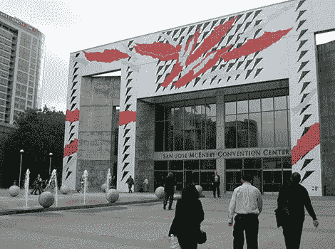

啊，潮湿的工程师的令人陶醉的香味！硅谷正在下雨，2010 年嵌入式系统会议正在圣何塞的 McEnery 会议中心举行。

ESC 主要是一个行业事件。过去也有一些比较轻松的节目，比如代表业余爱好者市场的 [Parallax，Inc.](http://hackaday.com/2010/04/05/internet-radio-player-wins-propeller-design-contest/) 和在博览会上行走的[巨型机器人长颈鹿](http://hackaday.com/2010/04/13/giant-robotic-giraffe-getting-a-giant-robotic-facelift/)。随着经济形势的恶化，最近的展览场地变得更小了，焦点也更加商业化了。尽管如此，在打算以百万计的价格出售的组件和比一些汽车还贵的示波器之间，人们仍然可以找到一些在大多数 Hack a Day 读者的预算范围内的漂亮的技术产品，以及一些优秀的经典 Hack 和技术演示…

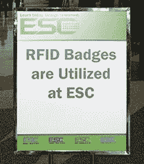

(Is that a promise or a threat?)

首要任务是跟进我们最近介绍过的几款产品…

去年 11 月，我们[评估了恩智浦的 mbed 原型开发平台](http://hackaday.com/2009/11/21/review-mbed-nxp-lpc1768-microcontroller/)。虽然没有令人震惊的新版本，但好消息是 [mbed](http://hackaday.com/2010/03/28/guitar-echo-pedal-built-with-mbed/) 社区正在变得强大，规模经济使得将入门套件的价格从 99 美元下调至最初的早期采用者成本 59 美元成为可能。

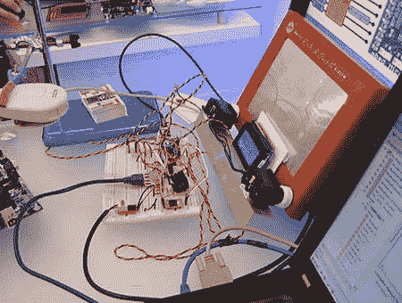

此外，他们在短短几天内就完成了一个项目，展示了 mbed 平台的原型制作简易性。看起来像是黑客日陈词滥调的清单，这个演示汇集了 [Twitter](http://hackaday.com/2010/04/20/twittering-pub-hanging/) 、徽标编程语言、网络直播、[伺服和一个蚀刻草图](http://hackaday.com/2010/01/04/step-a-sketch/)。你可以在 [mbed 博客](http://mbed.org/blog/entry/131/)上阅读更多内容，或者[观看直播](http://mbed.org/etch-a-sketch/)并在 ESC 节目时间参与。

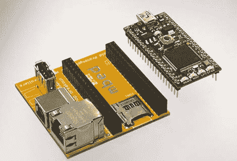

我们还喜欢这个小分线板，它为 mbed 添加了最重要的接口: [MicroSD](http://hackaday.com/2008/10/06/parts-microsd-memory-card-holders/) ，以太网和 USB 主机&客户端。这是为 mbed 研讨会快速制作的东西，虽然没有计划将其正式产品化，但我们被告知，未来可能会通过 [SparkFun 的 BatchPCB 服务](http://hackaday.com/2010/03/01/batchpcb-pays-you/)提供这种无人使用的电路板。

许多读者对 mbed 使用的以 web 为中心的开发方法以及缺少调试器感到厌烦。恩智浦的另一款入门级评估产品 [LPCXpresso](http://ics.nxp.com/lpcxpresso/) 从更传统的角度提供了一款价格合理的 ARM 开发套件。

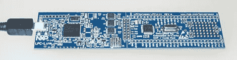

售价 30 美元的 LPCXpresso 板有 M0 Cortex 和 M3 Cortex 两种型号，包括一个集成的 JTAG 调试器。可下载的 Windows 开发环境基于 Eclipse IDE 和 GNU 工具链。安装了接头后，LPCXpresso 是[试验板](http://hackaday.com/2010/04/06/on-the-go-prototyping/)友好的，事实上与 mbed 共享相同的引脚排列，因此有一个现有的硬件生态系统可供使用。

STMicroelectronics 的 STM8S-Discovery 产生了巨大的影响[，当我们在 11 月份](http://hackaday.com/2009/11/23/stm8s-discovery-microcontrollers-reach-a-new-low/)提到这个 7 美元的套件时，几天之内就清除了分销商。在 ESC 上，ST 展示了他们新的超低功耗 8 位和 32 位 MCU，演示由仙人掌供电(经典的[柠檬电池](http://hackaday.com/2009/04/05/simple-elegant-lemon-battery/)的变体)，一杯温水放在[珀尔帖结](http://hackaday.com/2010/01/05/generate-electricity-with-a-candle/)上，以及一个适中的感应充电器。(什么，没有[风力](http://hackaday.com/2009/05/08/fart-intensity-detector/)？)

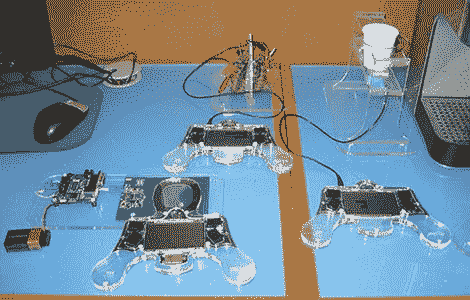

基于新的低功耗芯片的 STM8S-Discovery 的新版本将在几个月内上市，预计价格也同样低廉。

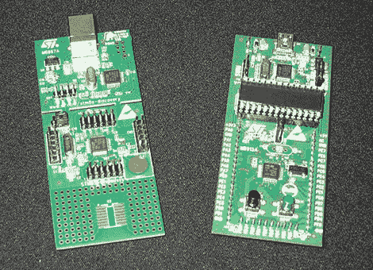

(Left: the original STM8S kit that created the ruckus. Right: the forthcoming STM8L kit.)

在德州仪器的展台上，BeagleBoard XM 正在展示，它几乎在各个方面都比它的前辈 T2 有所改进。

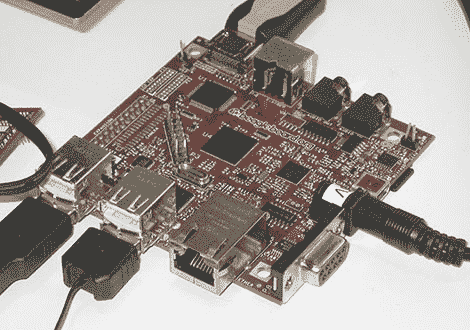

我们被告知 BeagleBoard XM 代表“额外的 MIPS”、“额外的内存”和“额外的钱”，他们开玩笑说。XM 不会取代原来的 BeagleBoard，但在 6 月份发货时，它将与 beagle board 一起以 179 美元的高价出售。XM 包括更快的处理器(1 GHz)，更大的 RAM (512 MB，1GB 型号可能即将推出)，以太网，更多的 USB 端口和改进的电源保护。NAND 闪存不见了，取而代之的是底部的 MicroSD 插槽。新的板稍大，但保留了相同的安装孔，因此它可能适合作为一些现有 BeagleBoard 项目的升级。

我们上个月提到的 Microchip 的 iPod/iPhone 配件开发板正在展出。不幸的是，在这些套件可以从 Microchip*订购*之前，一个人似乎必须签署苹果的“为 iPod 制造”开发者计划，这真的让那些可能只想[修补](http://hackaday.com/2010/04/01/arduino-ipod-library-work-continues/)的人扫兴了。

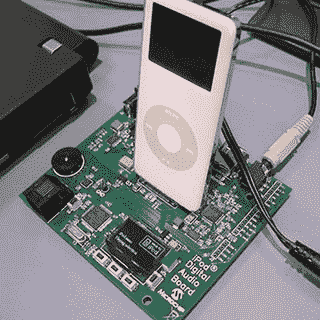

离产品细节越来越远，越来越多地进入黑客和视觉糖果…

产品拆卸已经成为科技文化的一个主题。“[零时差](http://hackaday.com/2010/04/03/ipad-teardown/)”和新产品的实时博客拆解特别令人兴奋。ESC 做得更好，在正式发布前几个月在*展示了一个产品(如果是一个相当深奥的产品的话):一个围绕微芯片 dsPIC 和一组电场传感器构建的高端锆石 AC 线探测器。就像工程师 pr0n！*

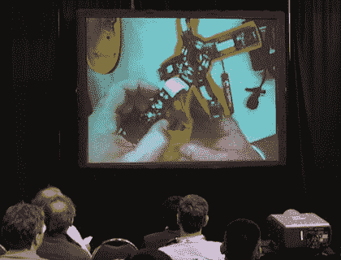

在这次活动中，国家仪器公司无疑是最有趣的展位之一。他们不是被动地展示枯燥的 PowerPoint 摘要和运行 LabVIEW(他们为工程师和科学家提供的图形编程环境)的显示器，而是展示利用该软件的物理演示和项目。有些很严重，有些不太严重。 *Hacks！*

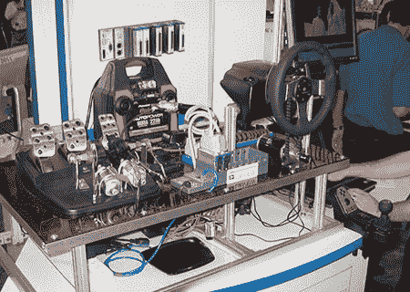

还记得滑铁卢实验室的 [iPhone 控制的汽车黑客](http://hackaday.com/2009/11/10/remotely-control-your-crappy-car-dangerously/)吗？在那里！相反，这是*减去实际的汽车，*，但所有的重要部件都很好地布置在我们可以观察钻机运行的地方。在展台的另一端，人们可以挑战“ [RockBot](http://video.intel.com/?fr_story=6c130c6cdef3160f2364d6932acabbee8669b501&rf=sitemap) ”来一轮 *Frets on Fire，*与我们之前见过的[hacks](http://hackaday.com/2009/10/30/cheating-rockband-again/)没有什么不同。

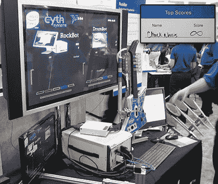

Hack a Day 的读者可能对 Digi International 的 [XBee 无线模块](http://hackaday.com/2010/03/05/rc-truck-source-for-robotics-platform/)很熟悉，比如 Adafruit 的 [Tweet-a-Watt](http://hackaday.com/2009/03/26/tweet-a-watt-kits/) 电源监控器中使用的模块。我们很容易被闪亮的东西分散注意力，最初我们被包裹在他们展台周围的可寻址 LED [矩阵](http://hackaday.com/2010/02/26/10x10-led-matrix/)所吸引；不是产品，只是能引起人们兴趣的东西:

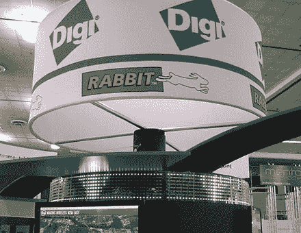

事实证明，在黑客背后还有一个额外的奖励黑客*。Digi 的大多数展台展示都可以使用他们自己定制的[网络应用](http://digidemo01.appspot.com/)来控制和监控，所以拿着 iPod touch 四处走动来运行展示是一件简单的事情:*

在 ARM 展馆，这台“ [Speedcuber](http://blogs.arm.com/arm-events/arm-powered-nokia-n95lego-rubiks-speedcuber-creation-video/) 在不到半分钟的时间内解决了[魔方](http://hackaday.com/2009/09/11/avr-controlled-rubiks-cube-solver/)。摄像机和解谜逻辑来自摩托罗拉[机器人](http://hackaday.com/2010/01/25/unlocking-multitouch-for-droid-and-nexus-one/)。命令通过蓝牙发送给一对乐高思维风暴控制器来驱动控制立方体的马达。

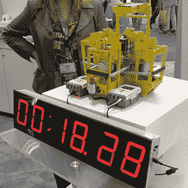

[Macraigor Systems](http://www.macraigor.com/) 生产了一系列 JTAG 调试器……但说实话，我们(以及几乎所有路过展台的人)几乎错过了这个事实，因为我们都被他们的演示应用程序分心了，其中包括一个壮观而优雅的[英特尔六足机器人](http://hackaday.com/2010/02/10/dexterous-hexapod-rocks-an-atom-processor/):

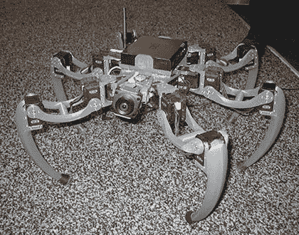

我们同样对[密码术研究公司的](http://www.cryptography.com/)德国[英格玛密码机](http://hackaday.com/2004/12/08/paper-enigma-machine/)大加赞赏，因为这是我们第一次看到一台*而不是*被锁在玻璃博物馆的箱子里:

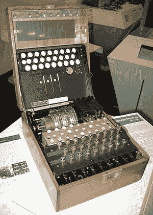

ESC 硅谷将持续到 4 月 29 日星期四，据我们所知，人们仍然可以在 ESC 网站上[注册免费的展览专用通行证](https://esc.embedded.com/sv/2010/Registrations/Registration?_mc=HOME)。