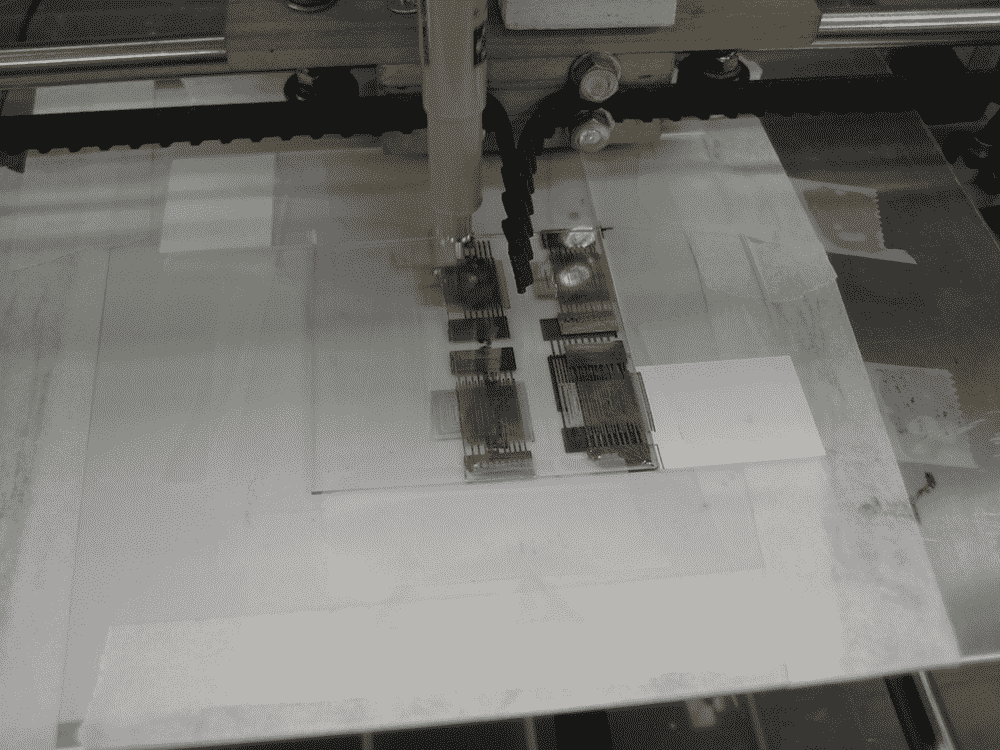

# 重新封装的晶体管

> 原文：<https://hackaday.com/2010/12/15/reprapped-transitors/>

在上周末的 [Botacon](http://www.botacon.com/) 会议上，金先生和【约翰·萨里克】做了一个关于他们如何制造有机场效应晶体管(OFETs)的报告( [pdf](http://mrkimrobotics.com/src/MrKim_Sarik_Printable_Transistors_part1-v1.3.pdf) )。打印晶体管需要一个木制 RepRap，Makerbot 公司的别出心裁地命名为[的独角兽](http://store.makerbot.com/makerbot-unicorn-pen-plotter-kit.html)(或从 [Thingiverse](http://www.thingiverse.com/thing:4186) 打印出来)，一只砍过的毡笔，一些化学品，和几件实验室设备。我们无法参加会议，所以这是我们从幻灯片中推断出来的。银墨被印刷到玻璃载玻片上以形成栅极区域，并被固化和部分掩蔽。将一层 CP1 树脂旋涂到载玻片上，以在栅极和半导体、漏极和源极区之间形成电介质阻挡层。再次使用银墨，这一次打印出漏极和源极区域。最后打印出来的是溶解在甲苯中形成半导体区域的 P3HT。有趣的是看到这一过程被修改，使得所有的涂层和固化可以在不从打印机上移除载玻片的情况下完成。