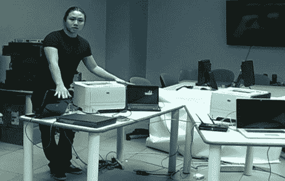

# 研究人员声称，惠普激光打印机可以被劫持来窃取数据和着火

> 原文：<https://hackaday.com/2011/11/30/researchers-claim-that-hp-laser-printers-can-be-hijacked-to-steal-data-and-catch-fire/>

昨天新闻铺天盖地，报道了哥伦比亚大学研究人员发布的一项研究，警告消费者惠普激光打印机很容易受到远程篡改和黑客攻击。研究人员声称，惠普 LaserJet 系列的大多数打印机在没有检查任何数字认证的情况下接受固件更新，这使得恶意用户可以远程滥用这些机器。研究人员甚至声称，修改后的固件可以用来使打印机的定影器过热，引起火灾，将敏感文件发送给罪犯，甚至迫使打印机成为僵尸网络的一部分。

惠普官员很快反驳了这一说法，称 2009 年及以后生产的所有型号都要求固件经过数字签名。此外，他们说，该品牌的所有激光打印机都配备了热切断开关，可以在任何真正的火灾风险出现之前减轻定影器的攻击向量。尽管惠普公司发表声明，研究人员袖手旁观他们的说法，声称脆弱的打印机仍然可以在主要的办公用品商店买到。

虽然使用防火墙可以很容易地防止大多数外部攻击，但这些打印机接受未签名固件的事实无疑是一个有趣的事实。我们很想知道这些披露是否会激励任何人创建他们自己的具有高级功能的自制 LaserJet 固件(以及[低墨粉警告覆盖](http://hackaday.com/2011/11/22/simple-low-toner-workaround-squeezes-out-a-few-extra-pages-when-your-printer-refuses/)),或者这一切是否只是在几周后失败。