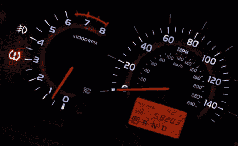

# 研究人员发现音乐可以破解汽车

> 原文：<https://hackaday.com/2011/03/17/researchers-discover-that-cars-can-be-hacked-with-music/>

2009 年，Stefan Savage 博士]和他的同事发表了一篇论文，描述了他们如何通过 OBD 端口接入 CAN 总线来控制汽车的计算机系统。为了入侵计算机系统，他们不满足于拥有对汽车的物理访问，他们继续探索，并发现了更多的攻击媒介。

一些漏洞似乎很容易被黑客攻击。研究人员发现了一种方法来攻击某些车辆中的蓝牙系统，以及其他车辆中的蜂窝网络系统。将恶意软件注入汽车修理厂使用的诊断工具也非常有效。然而，他们发现的最有趣的漏洞却出乎意料。

研究人员发现，一些汽车娱乐系统容易受到特制 MP3 文件的影响。被感染的歌曲允许他们在刻录成 CD 并播放时向系统中注入恶意代码。虽然随着 P2P 文件共享的流行，这种病毒可以很容易地传播，但目前它可能没什么用处。

研究人员表示，虽然他们发现了许多可能侵入汽车计算机系统的方法，但这些攻击很难实现，而且在不久的将来发生的可能性非常小。

然而，它确实给了我们思考的食粮。随着不同的车辆系统变得更加集成，汽车通过无线技术变得更加互联，谁知道会发生什么？我们只是希望永远不要看到我们购买新车时获得反恶意软件订阅的那一天——到那时，我们就只能骑自行车了，谢谢。

[图片由 [Autoblog](http://www.autoblog.com/2010/08/11/cars-hacked-by-researchers-through-wireless-tire-pressire-monito/) 提供]