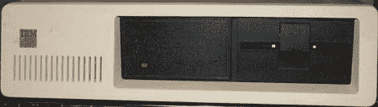

# 复活 XT

> 原文：<https://hackaday.com/2011/10/03/resurrecting-an-xt/>

人和老鼠的最佳计划经常出错。如果我们找不到 30 年前的电脑显示器，至少我们会这么告诉自己。[Andrew]最近在易贝买了一台旧的 IBM XT，[试着让视频工作起来](http://www.reenigne.org/blog/i-bought-an-xt/)。他还没有看到任何成功，但是他解决这个问题的方法非常聪明。

[Andrew]被困在一台很酷的旧电脑上，无法在屏幕上输出任何内容。XT 有一个 MDA 端口，但是他的电视和 VGA 显示器都不接受 MDA 频率。作为解决方法，[Andrew]将 Arduino 连接到 XT 键盘端口。在工厂里，IBM 的工人在发布信息时使用 XT 键盘将代码加载到机器上。他能够将 MDA CRT 控制器的频率改为 CGA 频率，并在一些小组件的帮助下[获得了一些视频工作](http://www.youtube.com/watch?v=pyXkyPzcL-0#t=3m03s)。

Hsync 和 Vsync 仍然关闭，而且[Andrew]还不能让机器完成发送，但他认为他可以使用 XT 键盘端口进行双向通信。他写了一个非常小的内核来测试一些东西，但是不幸的是 XT 的电源最近没电了。一旦(安德鲁)取代了他，我们确信他会让他的机器运转起来。