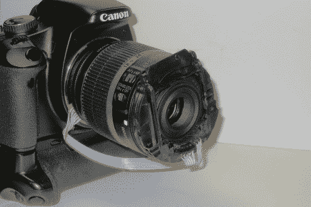

# 佳能单反相机的复古适配器

> 原文：<https://hackaday.com/2010/11/20/retro-adapter-for-canon-slr/>

[calculon]能够修改一个“哑”适配器，以允许他的佳能单反相机使用光圈并聚焦在一个[复古镜头](http://calculon.soup.io/post/88927239/Canon-retro-adapter)上。用他的新翻转安装广角镜头，他能够实现一些非常整洁的微距镜头。通过切掉一些更便宜的环，他能够将电线穿过并粘在相机的触点上。然后将电线连接到“新”透镜的输入端。一个新的适配器运行约 375 美元，这不仅是一个整洁的小黑客，但它也是一个省钱。你可以在他的[闪烁](http://www.flickr.com/photos/27020792@N07/5191134726/in/set-72157625428096970/)上看到更多他的照片