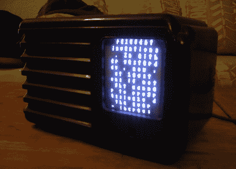

# 复古硬件混搭喷出古老的极客

> 原文：<https://hackaday.com/2012/02/22/retro-hardware-mash-up-spouts-archaic-geekery/>

这个可爱的小盒子只有黑客才会喜欢。它使用一些二手硬件来显示来自巴克明斯特富勒的随机言论。上面的图像没有显示公正。还有其他照片显示非常清晰的字体，更容易阅读。

[Autuin]总是在消费者寿命结束时留意酷装备。这个项目的屏幕是一个科尔曼电视灯笼的阴极射线管(你知道，野营用的…呸！).它在他几年前买的一台旧的不能用的收音机的底盘上找到了一个家。有了这些部件，真正的冒险就开始了:让 Arduino 读取报价并生成电视输出信号来显示它们。

我们喜欢他用从当地电子商店买来的卡边连接器制作的 SD 卡支架。从那里，他在互联网上寻找帮助，在哪里接入电视信号。一旦发现了正确的轨迹，Arduino 电视输出库就会完成繁重的工作。