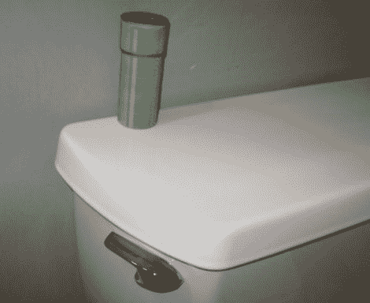

# 复古电子游戏声音…为你的厕所

> 原文：<https://hackaday.com/2011/06/06/retro-video-games-sounds-for-your-toilet/>

在读了一篇关于超级马里奥兄弟主题浴室的文章后，【乔纳森】决定让他的马桶在有人冲水时发出“翘管”声会很酷。

他在易贝上抓了一个小的声音下降钥匙链，把它拆开，看看它是如何工作的。一旦他弄清楚了哪些焊盘对应于翘曲管声音，他就添加了一些电线，当这些电线短路时，就会触发声音效果。

他争论声音发生器应该如何连接到马桶，由于担心音量和水的破坏，他非常不愿意将钥匙链放在水箱内。他最终决定使用摩擦电荷触发音效，就像 80 年代的触摸灯一样。他组装了一个简单的电路，连接到马桶手柄和墙上的进水阀。当有人触摸手柄时，他们手中的小电荷会触发声音效果，正如你在下面的视频中看到的那样。

他没有使用标准的项目箱，而是选择用纸板和纸制作一个小的曲管复制品，这真的很好地将所有东西结合在一起。

虽然他说这个电路相当敏感，在奇怪的时间触发或者根本不触发，但我们仍然认为它很棒。

[https://www.youtube.com/embed/DdcI_0e8Da0?version=3&rel=1&showsearch=0&showinfo=1&iv_load_policy=1&fs=1&hl=en-US&autohide=2&wmode=transparent](https://www.youtube.com/embed/DdcI_0e8Da0?version=3&rel=1&showsearch=0&showinfo=1&iv_load_policy=1&fs=1&hl=en-US&autohide=2&wmode=transparent)