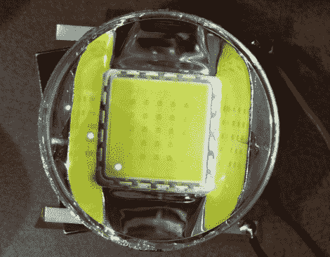

# 用大功率发光二极管改装液晶投影仪

> 原文：<https://hackaday.com/2011/04/04/retrofitting-lcd-projectors-with-high-powered-leds/>

[Devon]最近修理了一些 Phillips LCD 投影仪，他非常兴奋地使用这些投影仪。唯一的问题是，他不想在每使用 2000 小时后以 100 美元的价格更换灯泡。他非常有信心能够找到更好的方法来驱动投影仪，所以他再次拆卸了它们，并开始四处寻找灯泡的替代品。

他认为一个大功率的 LED 就可以了，所以他订购了一些零件，开始了他的第一次改装。使用他的示波器，他发现当投影仪通电时，控制板向高压板发出脉冲，并继续发出脉冲信号，直到机器关闭。此时，高压板关闭灯泡。

他使用 PIC 创建了一个小电路，用于解释来自控制板的初始脉冲，以及观察投影仪通电时出现的稳定“心跳”脉冲。该板用于控制他购买的高功率 LED 的驱动板。

就色彩保真度而言，他的灯泡替代品工作良好，但远没有他希望的那么亮。他计划在不久的将来采购一些更亮的 led 或汽车 HID 灯，我们期待看到他是否能达到原来灯泡的亮度。