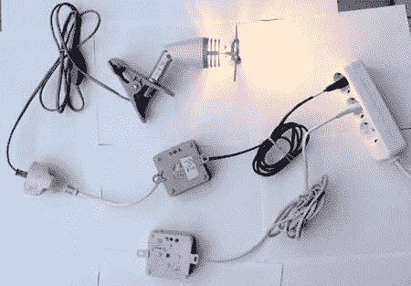

# 对交流信号协议进行逆向工程

> 原文：<https://hackaday.com/2012/02/04/reverse-engineering-an-ac-signal-protocol/>

[Arpad]已经花了相当多的时间对一个家庭自动化系统进行逆向工程，并且，正如他很快指出的那样，提供的信息仅供参考。他真的做了功课(并且很好地记录了它)，调查了[美国专利申请](http://www.google.com/patents?id=cHirAAAAEBAJ&zoom=4&pg=PA14#v=onepage&q&f=false)，并且弄清楚了协议是如何工作的。

如果你想知道有人如何能够通过交流正弦波发送信号，至少有一种技术是专有的[通用电力线总线]。这是通过发送精确的时间脉冲和正常存在的波来实现的。如果另一端有正确的软件，就可以对其进行解码，并用于任何必要的数据传输。

虽然作为工程师和技术专家，我们当然不会宽恕窃取专利，但其中一点是，其他人被允许了解你的秘密，以换取一些法律保护。[Arpad]这样做的动机是，这项技术只在美国广泛使用，我们只有微不足道的 120 VAC 60Hz 电源。有了这些知识，他就能把它转换成欧洲 230 VAC 50Hz 的电压。

[https://www.youtube.com/embed/xVScZVuY2ug?version=3&rel=1&showsearch=0&showinfo=1&iv_load_policy=1&fs=1&hl=en-US&autohide=2&wmode=transparent](https://www.youtube.com/embed/xVScZVuY2ug?version=3&rel=1&showsearch=0&showinfo=1&iv_load_policy=1&fs=1&hl=en-US&autohide=2&wmode=transparent)