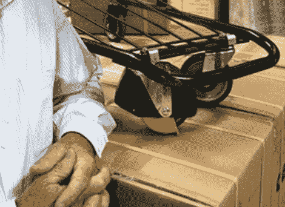

# 反向工程购物车安全性

> 原文：<https://hackaday.com/2011/02/28/reverse-engineering-shopping-cart-security/>

所有这些关于 555 定时器的讨论导致了一些项目的突然出现，比如这个[逆向工程购物车安全机制](http://www.woodmann.com/fravia/nola_wheel.htm)。上面看到的轮子监听特定的磁信号，当遇到时，它锁住黄色的整流罩，防止轮子接触地面，使手推车很难移动。

[Nolan Blender]出于测试目的获得了其中一个轮子，他发布了一些关于内部硬件的细节。但他做的第一件事是组装一些测试设备，以帮助找出触发机制的信号的细节。他把一个线圈连接到一个音频放大器上，在市场上走来走去寻找强信号。一旦他用那个设备发现一些强烈的爆发，他抓起一个示波器，把它钩在线圈上，做了一些测量。他发现了一个占空比为 50%、间隔为 30 毫秒的 8 kHz 信号(很难找到更好的理由来解释为什么需要示波器)。

有了规格在手，[诺兰]抓住两个 555 定时器，一个音频放大器，和一个围绕铁氧体磁心的 200 圈天线来建立自己的锁定机制。如果你曾经在市场中间突然停下来，只需寻找过道尽头拿着自制电子产品的黑客。

[ [照片来源](http://www.nctimes.com/business/article_60842fb7-0cdd-5831-ab93-7c599e1625dd.html)

[谢谢科林]