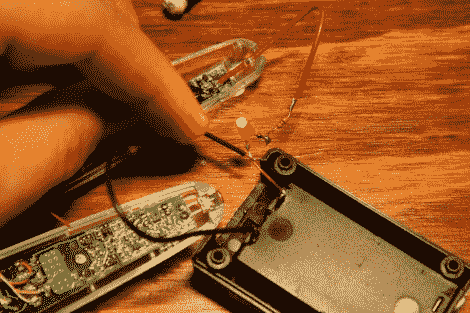

# 破冰船 POV 玩具的逆向工程

> 原文：<https://hackaday.com/2011/12/21/reverse-engineering-the-icebreaker-pov-toy/>

[Ch00f]花了一些时间[弄清楚破冰者 POV 玩具是如何工作的](http://ch00ftech.com/2011/12/20/in-which-i-spent-my-weekend-reverse-engineering-a-childrens-toy/)。这是一个非常酷的设备，只有牙刷托那么大。它在一个透明的塑料盒子里，让 32 个表面贴装 led 发光。但是发光并不是它们唯一的功能。您可以使用该设备以高对比度设计进行扫描，然后利用 LED 灯条的视觉暂留显示特性进行“回放”。

也许[Ch00f]心中最大的问题是感知是如何完成的。他做了一系列的观察，然后开始摆弄发光二极管来研究它们。似乎一个 LED 被点亮，而它周围的 LED 被用作光传感器。一旦他意识到显示器是多路复用的，这就变得更加令人困惑了。

他的文章包括一系列原理图，可以拼凑出整个电路的概念。上面的图像是在这个过程中拍摄的，使用一个 LED 来检查零件上的连接。这让他证明了它是一个 N 沟道 MOSFET。他计划将学到的东西应用到自己的项目中。

[via [Reddit](http://www.reddit.com/comments/njsky)