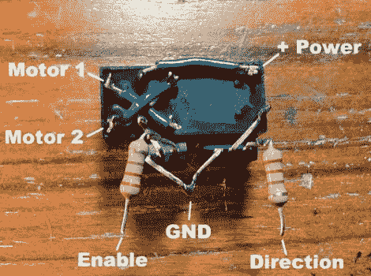

# 基于可逆继电器的电机控制器

> 原文：<https://hackaday.com/2011/04/14/reversible-relay-based-motor-controller/>

[Nothinglabs]制造了这个[电机控制器，作为使用 H 桥](http://www.instructables.com/id/Super-Easy-Reversible-Motor-Control-for-Arduino-/)的替代方案。他们称之为 RAT 控制器，代表“继电器和晶体管”。你可以在上面看到，两个达林顿晶体管及其基极晶体管允许逻辑信号打开和关闭继电器，根据继电器的打开或关闭状态，以一个方向或另一个方向驱动电机。休息后在视频中看到它的工作。

这是一个很好的小工作区，部件很少，但因为继电器是机械的，所以与固态电机控制器相比，寿命很短。没关系，因为这里的动机是手头缺少零件，而不是性能的提高。同样值得一提的是，当你不想通过邮件等待组件订单时，所有这些部件都可以在你当地的 Radio Shack 购买。我们当然意识到它比[[戴维·库克的] H 桥](http://www.robotroom.com/BipolarHBridge2.html)需要更少的元件。他的设计是我们最喜欢的——[我们在自己的项目中使用过](http://hackaday.com/2010/01/31/recycled-cat-feeder/)——但是在快速和肮脏方面，使用这种死虫式焊接需要的五个组件和短组装时间是无与伦比的。

[https://www.youtube.com/embed/wvhB0gCcZC0?version=3&rel=1&showsearch=0&showinfo=1&iv_load_policy=1&fs=1&hl=en-US&autohide=2&wmode=transparent](https://www.youtube.com/embed/wvhB0gCcZC0?version=3&rel=1&showsearch=0&showinfo=1&iv_load_policy=1&fs=1&hl=en-US&autohide=2&wmode=transparent)