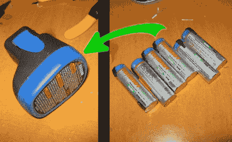

# 恢复你疲惫的德莱梅尔电池组

> 原文：<https://hackaday.com/2011/01/23/revive-your-tired-dremel-battery-pack/>

原来，在那个无绳德勒梅尔电池组里，只有六节镍镉 AA 充电电池。是的，你可以在任何地方买到标准的可充电 AA 电池，现在你可以通过遵循 Stuuf 的指南来恢复老化的电池组。既然你已经在做了，多花几块钱就可以通过使用优质的镍金属氢化物电池实现真正的升级，这种电池在两次充电之间的使用时间应该是原来的三倍。我们完全理解有一个电池组，因为外壳的形状是手持工具的一部分，它应该很容易作为一个单元互换电池。我们只是希望电池组的设计能让用户在用完 AA 电池后将其换出。

你有其他需要提神的无绳工具吗？检查这个[牧田电池组维修黑客](http://hackaday.com/2010/01/12/makita-battery-pack-repair/)的一个正确的方向。

[谢谢蓝色幽灵]