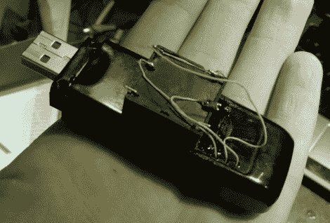

# 通过一点巧妙的调查，复兴一个破碎的 HSDPA 调制解调器

> 原文：<https://hackaday.com/2011/03/18/reviving-a-broken-hsdpa-modem-with-a-bit-of-clever-investigation/>

一日黑客论坛成员[死灵]最近在做路由器[时犯了一个可怕的错误](http://forums.hackaday.com/viewtopic.php?f=3&t=463)。他把错误的电源插头接到路由器上，造成了 2.5v 的过电压。路由器本身很好，因为它包含一个很好的降压转换器，但连接到路由器 USB 端口的 HSDPA 调制解调器就没那么幸运了。USB 主机似乎是直接从路由器的电源供电，没有任何转换——这意味着当他使用错误的插头时，他的调制解调器得到了一个不错的 7.5v zap。

他认为调制解调器已经坏了，所以他认为拆开它没有坏处。他检查了调制解调器的电路板，发现当插入时，板载降压转换器向 PCB 的其余部分提供 0 伏电压。他在网上找不到转换器的任何文档，所以他使用了一点点~~试错法~~聪明的调查来确定降压器在被烹饪之前提供了什么样的电压。

在用他自制的低压差稳压器进行了一些测试后，他确定损坏的降压器为调制解调器的其余部分提供了 3.3v 的电压(对于那些一直关注的人来说，这是 4.2v 的过压)。他在电路板上增加了一个线性稳压器来代替旧的降压稳压器，后者在过热前工作了大约 15 秒。

最后，他决定在调制解调器上添加一个相当大的 3.3v 降压转换器，从而打破了美感。其结果是一个丑陋，但相当实用的 HSDPA 调制解调器。