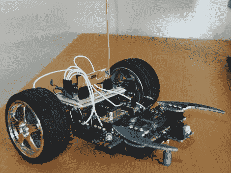

# 从终端窗口控制的射频机器人

> 原文：<https://hackaday.com/2011/05/24/rf-robot-controlled-from-a-terminal-window/>

这个机器人可以通过你电脑的终端窗口来控制。你可以看到一个马尼拉彩色板安装在轮子之间。这是一个射频接收器，它有一个很长的天线，为了更好地观察机器人，我们把它露了出来。[Ashish]花了大约 4 美元买了一对射频发射器/接收器，休息之后你可以看他给我们演示他用来控制的方法。

首先，他必须找到一种方法把发射机和他的计算机连接起来。他决定使用 Arduino，因为从电脑向它发送数据就像写入/dev/ttyUSB0 一样简单。Arduino sketch 只是监听串行连接上的传入字符，并将它们推过 RF 发射器。

我们喜欢他的开发方法。在视频中，他展示了用于驱动和停止机器人的命令语法。一旦他明白了这一点，他就写了一个 shell 脚本，让这个机器人按照预先设定的方形路径运行。从那以后，再多一点编码就能让他进行实时控制，这种控制可以扩展到类似于基于网络的智能手机控制界面。

哦，如果你想知道机器人本身，它是一个通常使用红外控制的成套机器人。[Ashish]升级到射频，因为它不需要视线才能工作。

[https://www.youtube.com/embed/XCPWYiKda0I?version=3&rel=1&showsearch=0&showinfo=1&iv_load_policy=1&fs=1&hl=en-US&autohide=2&wmode=transparent](https://www.youtube.com/embed/XCPWYiKda0I?version=3&rel=1&showsearch=0&showinfo=1&iv_load_policy=1&fs=1&hl=en-US&autohide=2&wmode=transparent)

[从[提示框](http://hackaday.com/contact-hack-a-day/)和通过[破解的小工具](http://hackedgadgets.com/2011/05/23/computer-controlled-wireless-robot-build/)