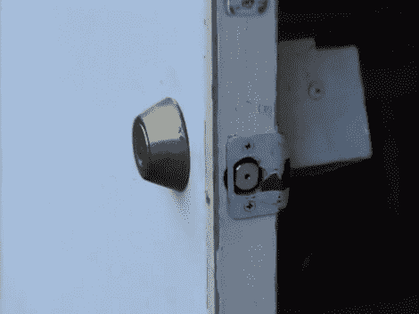

# RFID 进入使用自制的电子罢工

> 原文：<https://hackaday.com/2010/09/09/rfid-entry-uses-homemade-electronic-strike/>

[Fileark] [建造了一个 RFID 进入系统](http://filear.com/index.php/electronics/38-circuits/74-diy-rfid-keyless-entry-system)，它使用了一个非常巧妙的替代电子撞击板的方法。电子锁扣是一种相当昂贵的铰接板，它安装在门框上并抓住门闩。但是这个系统打开了一组双门。没有把手的门被固定在适当的位置，并且具有正常的锁舌片。但是它也有一个与该板成一直线安装的锁舌。当锁舌伸出时，它与锁舌片平齐，将门闩从门把手上推回，使门自由摆动打开。这有点难以用语言表达，所以休息后看视频来澄清事情。

该系统使用廉价的 RFID 封装，提供单一信号线。这条线连接到一个旧的录像机马达，它转动锁销。定时是由一个 555 芯片提供的，插销的移动是由安装在马达上的几个开关来限制的。

既然已经建立了解锁机制，那么使用其他身份验证方法来打开门就很简单了，比如[基于手表的接近系统](http://hackaday.com/2010/01/21/coded-entry-using-your-wristwatch/)。

[https://www.youtube.com/embed/hpOeuOM0NBo?version=3&rel=1&showsearch=0&showinfo=1&iv_load_policy=1&fs=1&hl=en-US&autohide=2&wmode=transparent](https://www.youtube.com/embed/hpOeuOM0NBo?version=3&rel=1&showsearch=0&showinfo=1&iv_load_policy=1&fs=1&hl=en-US&autohide=2&wmode=transparent)