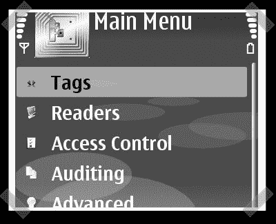

# RFID 卫士 V3 发布

> 原文：<https://hackaday.com/2007/11/05/rfid-guardian-v3-released/>

【fbz】想要确保每个人都知道 [RFID Guardian](http://www.rfidguardian.org/index.php/Main_Page) 已经发布了他们设计的[最新版本](http://www.rfidguardian.org/index.php/RFID_Guardian_V3)。我很难找到一个硬件的好镜头，所以我用了诺基亚手机[控制应用](http://www.rfidguardian.org/index.php/Nokia_Cellphone_User_Interface)。这里有一个项目[的简短说明](http://www.rfidguardian.org/index.php/High-Level%20Overview)。我想指出网站上的[使用示例](http://www.rfidguardian.org/index.php/Nokia_Cellphone_User_Interface)，但是看起来他们的 MYSQL 服务器正在耗尽内存。在去年的 shmoocon[和 defcon](http://shmoocon.org/)上看到[这个演讲](http://video.google.com/videoplay?docid=-1866201665047516046)之后，守护者肯定有一些好的用途。(一旦你度过了缓慢的开始，少校的介绍就非常有趣。–跳过前 8 分钟，否则你会感到无聊。)

*   [永久链接](http://www.rfidguardian.org/index.php/RFID_Guardian_V3)