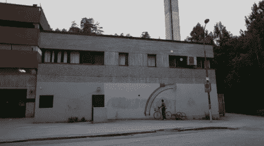

# Robo 彩虹涂鸦机

> 原文：<https://hackaday.com/2011/02/02/robo-rainbow-graffiti-machine/>

[mudlevel]为圣地亚哥的一个艺术展制造了这个[彩虹涂鸦制作机器人](http://www.adafruit.com/blog/2011/02/01/untitled/)。虽然没有建设细节，我们可以很容易地从图片中挑选出来。看起来大脑是一个 arduino，驱动器是一个移除了扳机的电钻，以及一些其他用于发射喷雾罐的伺服系统。制造彩虹的配重臂也是个不错的主意。看着这个，我们有了一个超级简单的纯机械方法来做到这一点，类似于一个弹射器。你可以利用拖车的运动，通过一个简单的棘轮线轴连接到车轴上来“上紧”平衡重。启动喷雾罐，让天平下降，就大功告成了。踩下踏板，为另一道彩虹重新上弦。