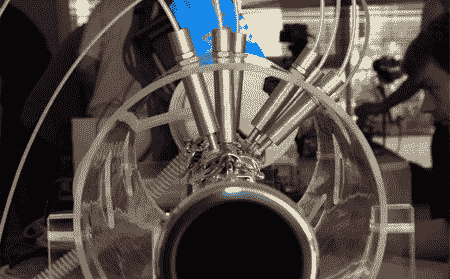

# Robot Clarinet

> 原文：<https://hackaday.com/2008/06/20/robot-clarinet/>

澳大利亚研究小组 NICTA 联合新南威尔士大学凭借他们的[机器人单簧管演奏者](http://nicta.com.au/news/current/australian_researchers_hit_winning_note_with_robot-operated_clarinet)赢得了 [2008 Artemis 乐团比赛](https://www.artemisia-association.org/artemis_orchestra)。比赛要求参赛者设计能够演奏未经修改的乐器的嵌入式系统。NICTA 凭借他们的 roboclarinet 获得了一等奖，主要是因为机器人“嘴”的复杂性它使用两个伺服电机作为舌头和嘴唇的代理，以与人类演奏一致的方式振动单簧管的簧片。单簧管的琴键是由一系列黄铜活塞推动的。机器人的所有功能都由运行 Linux 的计算机控制。如果伟大的声音或新颖的技术对你来说还不够，那么这个项目至少值得一看机器人吸引人的，略带蒸汽朋克风格的外观。休息之后请观看它的运行。

<http://www.youtube.com/v/mAIeTm4lO5Q&amp;hl=en>

【via[Linux devices](http://www.linuxdevices.com/news/NS7651953393.html)

*   [永久链接](http://nicta.com.au/news/current/australian_researchers_hit_winning_note_with_robot-operated_clarinet)