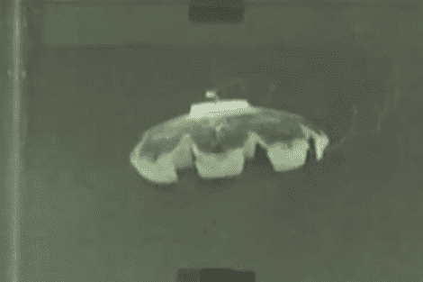

# 机器水母以周围水中的氢为燃料

> 原文：<https://hackaday.com/2012/03/22/robot-jellyfish-fueled-by-hydrogen-from-the-water-around-it/>

谈到机器人，RoboJelly 肯定不是我们习惯看到的样子。这种软体动物不是冰冷的金属骨架，而是模仿没有骨头的水母。但这并不是唯一不同寻常的地方。这个机器人也没有自带电源。它从周围的水中获取运动所需的能量。

在广告之后，人造肌肉赋予了这一段视频中的动作。这些肌肉对热量有反应，而热量是通过化学反应产生的。构建方法从肌肉材料开始，然后覆盖碳纳米管，最后涂上黑色铂粉。听起来有点像巫术，嗯(蝾螈之眼，龙心弦等。)?我们当然没有化学背景来理解这一切是如何工作的。但我们印象深刻。到目前为止，它还没有改变方向的能力，所有肌肉材料的弯曲是同时发生的。但是他们研究的下一步将是找到一种方法来引导“燃料”,给它一些方向。

**编辑**–看起来像是外部加油。实际的学习[在这里](http://iopscience.iop.org/0964-1726/21/4/045013)，但是需要登录下载。

这让我想起了另一个受水母启发的机器人。[看看 FESTO 的产品](http://www.youtube.com/watch?v=mKMN-dz8n3k)，它可以轻松地在空中飞行。

[https://www.youtube.com/embed/U2OSJQhHQp8?version=3&rel=1&showsearch=0&showinfo=1&iv_load_policy=1&fs=1&hl=en-US&autohide=2&wmode=transparent](https://www.youtube.com/embed/U2OSJQhHQp8?version=3&rel=1&showsearch=0&showinfo=1&iv_load_policy=1&fs=1&hl=en-US&autohide=2&wmode=transparent)

[via [Reddit](http://www.reddit.com/r/gadgets/comments/r6gwp/researchers_have_created_a_robotic_jellyfish/)