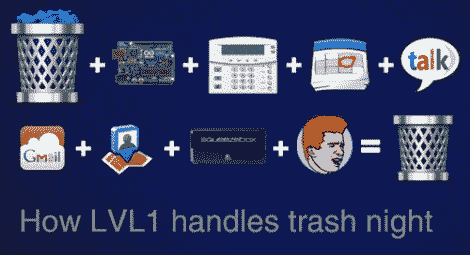

# 机器人统治者需要做家务来换取技术

> 原文：<https://hackaday.com/2012/02/20/robot-overlords-require-chores-in-return-for-technological-access/>

看起来，如果你没有完成家务，你可能不会完全沉浸在数字世界中。LVL1 黑客空间的成员已经为他们的巢穴组装了许多自动化设备，但没有什么能像防止恶作剧的垃圾清除系统一样充分发挥他们称之为“母亲”的系统的效用。或者通俗点说，被妈妈唠叨到你倒垃圾桶。

所以先来一点背景知识。还记得那个传感器阵列[上有太多的环境传感器](http://hackaday.com/2012/01/17/sensor-array-tries-to-outdo-the-other-guys/)吗？这只是自动化系统(母亲)测量周围环境的一种方式。看来黑客空间已经建立了一堆脚本[来与社区的各个方面进行交互。](http://www.lvl1.org/2012/02/15/mother/)

例如，在垃圾收集的前一天晚上，系统开始让成员知道这是垃圾之夜，有人需要清空垃圾。罐子下面有一个压力传感器，它会提醒妈妈罐子被移动了。但是如果没有人移动罐子呢？和谷歌说再见吧。是的，它会屏蔽所有的谷歌搜索直到任务完成。这只是它的一系列惩罚措施中的一种。

如果你只是移动易拉罐而不把它拿出来呢？没有骰子。母亲也在监控车库门，需要打开车库门才能把特大号罐头拿到垃圾箱里。在她变得讨厌之前，你有五分钟的时间做那件事。

[谢谢乔纳森]