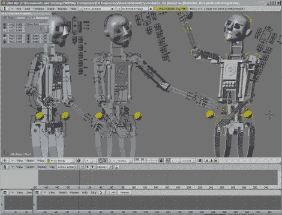

# 机器人专家:查克·e·奶酪娱乐回家了

> 原文：<https://hackaday.com/2010/02/25/robothespian-chuck-e-cheese-entertainment-comes-home/>

还记得你的八岁生日聚会吗？当时查克奶酪公司的电子乐队专门为你唱了一首生日快乐歌。现在你可以在一年中的任何一天和机器人医生一起享受这一切。完整的 animatronic 平台已经在 [Blender 3D](http://www.blender.org/) 中建模。给机器人制作动画就像从它的数字模型制作动画一样简单。嘴唇同步是自动生成的，模特头部右侧的手柄控制面部表情。

使用 Blender 作为编舞工具真是太棒了。我们希望有人能在今年的万圣节表演中运用这项技术。

[感谢 Rob via [BlenderNation](http://www.blendernation.com/robothespian/)