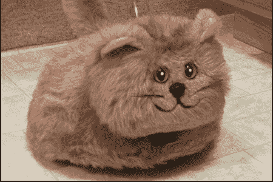

# 机器猫

> 原文：<https://hackaday.com/2008/05/31/robotic-cats/>

今天是猫日，所以我们来贴一些奇怪的猫吧。经过一点研究，我们发现了商业猫、业余爱好猫、研究猫和机器人猫。

首先出场的是[内科罗](http://www.necoro.com/)。2001 年发布，这可能是最受认可的商业机器猫；以恐怖闻名。

<http://www.dailymotion.com/swf/x2vf1s&amp;related=1>

   
不想被市场拒之门外的世嘉开发出了自己的令人毛骨悚然的猫。Yume 猫微笑售价 72 美元，正如视频所示，当你拉它的尾巴时，它会变得非常恼火。

家用机器猫并不是什么新发明。直接从“泰迪·鲁克斯平时代”走出来的是[宠物豪华版](http://www.x-entertainment.com/articles/0849/)。毛皮覆盖的机器人肿块可以避开障碍，对拍手做出反应，或使用有线遥控器。

飞利浦研究公司进入这场猫科噩梦的是 T2 的 iCat T3。这是一只 38 厘米高的猫，配备了 13 个伺服系统来控制面部动作。我们的目标是拥有一个研究人机互动的共享平台:人与长相怪异的猫的互动。

<http://www.youtube.com/v/l1lEAfeRsEI&amp;hl=en>

  
爱好机器人的公司 Dynamizer 趁着人形机器人的普及，[开发了一款入门级猫机器人](http://www.robots-dreams.com/2006/06/dynamizer_has_a.html)。它设计得很便宜，并且易于扩展新的传感器。

<http://www.youtube.com/v/q2MXrUkNe2U&amp;hl=en>

  
上图是 Lim Tian Siak 打造的猫抓机器人。

<http://www.youtube.com/v/M_UyGP9d2R8&amp;hl=en>

  
最后，我们有猫王，这只电子人猫。他在一次事故中失去了后腿，所以他的[战斗机器人建筑管理员](http://www.robotcombat.com/)创造了一个他可以通过按下两个按钮来驾驶的机器人。看起来，如果有合适的设备，猫会顺时针旋转。